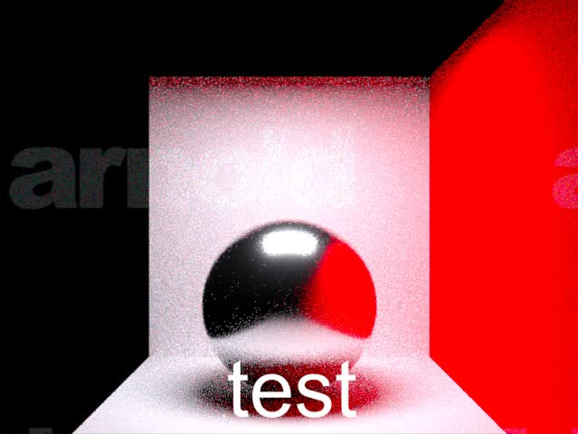
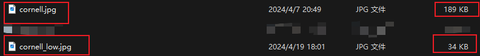
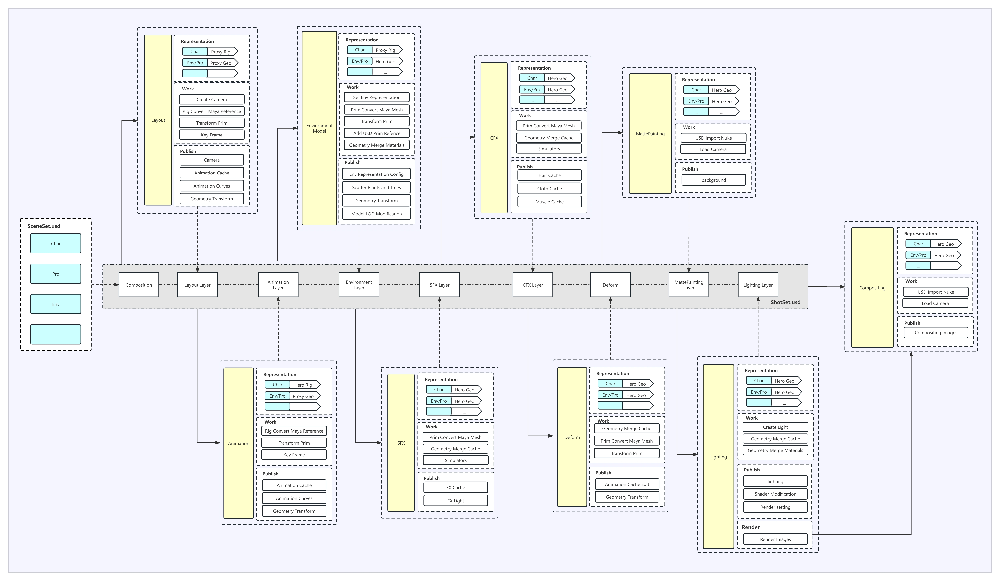

# 科普向合集

## Arnold light 的 intensity、exposure和到物体之间距离的关系

```python
instensity = 1 * 2^exposure
#举例：i=1 e=21 ==》i=1*2^21=2097152 e=0
exposure = log2(instensity)

#这里的距离是只物体到灯光的距离
instensity = Distance^2
#在灯光上加上这个表达式，可以实现在保持灯光亮度不变的情况下自由的移动灯光方向
#light.instensity = pow(objShape.distance,2)
```

## ASWF

## ffmpeg

### 图片格式转换

1. exr转换png

   ```powershell
   ffmpeg -i a.exr a.png
   ```

2. 通过ass字幕添加图片水印,首先需要一个ass字幕文件,可以自动生成也可以手动创建

   ```assembly
   [Script Info]
   Title: Watermark
   ScriptType: v4.00+
   PlayResX: 640
   PlayResY: 480
   
   [V4+ Styles]
   Format: Name, Fontname, Fontsize, PrimaryColour, Alignment
   Style: Default, Arial, 24, &HFFFFFF, 2
   
   [Events]
   Format: Layer, Start, End, Style, Text
   Dialogue: 0,0:00:00.00,0:00:10.00,Default,,{\fs100}test
   ```

   ```powershell
   ffmpeg -i a.jpg -vf "ass=zimu.ass" b.jpg
   ```

   

   

3. 图片质量压缩

   ```powershell
   ffmpeg -i a.jpg -quality 80 b.jpg
   ```

   

### 视频格式转换

1. mov转换MP4

   ```powershell
   ffmpeg -i a.mov a.mp4
   ```

2. 2.mov转换x264 H.264/MPEG-4 AVC 编码器 的MP4

   ```powershell
   ffmpeg -i a.mov -c:v libx264 a.mp4
   ```

   

## Kick 命令行详解

```powershell
### 参数说明：


`-i %s`：输入场景文件
`-o %s`：输出文件名
`-ocs %s`：渲染窗口的输出色彩空间
`-aov %s`：选择渲染窗口显示的AOV
`-r %d %d`：图像分辨率
`-sr %f`：在每个维度上缩放分辨率%f倍
`-rg %d %d %d %d`：渲染区域（最小x 最小y 最大x 最大y）
`-as %d`：抗锯齿采样数
`-asmax %d`：抗锯齿采样数最大值（用于自适应采样）
`-af %s %f`：抗锯齿滤波器和宽度（box triangle gaussian等）
`-asc %f`：抗锯齿采样限制
`-c %s`：活动相机
`-sh %f %f`：动态模糊快门（开始 结束）
`-fov %f`：相机视场角
`-e %f`：相机曝光
`-ar %f`：像素宽高比
`-t %d`：线程数
`-tp %d`：线程优先级（0..3）
`-device %s`：渲染设备（cpu|gpu）
`-gpu %s`：启用的GPU设备
`-gpu_warm`：运行GPU缓存预热预处理
`-bs %d`：桶大小
`-bc %s`：桶扫描（top left random spiral hilbert）
`-td %d`：总射线深度
`-dif %d`：漫反射深度
`-spc %d`：镜面深度
`-trm %d`：透射深度
`-ds %d`：漫反射采样数
`-ss %d`：镜面采样数
`-ts %d`：透射采样数
`-d %s`：禁用（忽略）特定节点或节点.参数
`-it`：忽略纹理贴图
`-is`：忽略着色器
`-cm %s`：设置ai_default_reflection_shader.color_mode的值（与-is一起使用）
`-sm %s`：设置ai_default_reflection_shader.shade_mode的值（与-is一起使用）
`-om %s`：设置ai_default_reflection_shader.overlay_mode的值（与-is一起使用）
`-ib`：忽略背景着色器
`-ia`：忽略大气着色器
`-il`：忽略灯光
`-id`：忽略阴影
`-isd`：忽略网格细分
`-idisp`：忽略位移
`-ibump`：忽略凹凸映射
`-imb`：忽略动态模糊
`-idof`：忽略景深
`-isss`：忽略次表面散射
`-ii`：忽略imagers
`-iops`：忽略操作员
`-flat`：平面着色
`-sd %d`：最大细分次数
`-set %s.%s %s`：设置节点参数的值（-set name.parameter value）
`-er %s`：在指定电子邮件地址下静默发送错误报告的选项
`-der`：禁用错误报告
`-dw`：禁用渲染和错误报告窗口（建议用于批量渲染）
`-dp`：禁用渐进式渲染（建议用于批量渲染）
`-ascii`：启用文本模式渲染预览（将调整分辨率以匹配终端大小）。需要UTF-8 24位终端
`-ipr [m|q]`：交互式渲染模式，使用Maya（默认）或Quake/WASD控制
`-turn %d`：渲染n帧，围绕看点点旋转相机
`-turn_smooth`：在使用-turn渲染转台时使用平滑启动/停止
`-lookat %f %f %f`：覆盖相机看点（如果相机由矩阵指定，则很有用）
`-position %f %f %f`：覆盖相机位置
`-up %f %f %f`：覆盖相机上向量
`-frame %f`：从输入场景文件选择特定帧
`-v %d`：详细级别（0..6）
`-nw %d`：最大警告数
`-logfile %s`：将日志文件写入指定的文件路径
`-ostatsfile %s`：将统计数据写入指定的.json文件，如果存在则覆盖
`-statsfile %s`：将统计数据追加到指定的.json文件
`-profile %s`：将配置事件写入指定的.json文件
`-l %s`：为插件库添加搜索路径
`-nodes [n|t]`：列出所有已安装的节点，按名称（默认）或类型排序
`-info [n|u] %s`：为给定节点打印详细信息，按名称或未排序（默认）排序
`-tree %s`：为给定节点打印着色树
`-repeat %d`：重复渲染n次（用于调试）
`-resave %s`：将场景重新保存为文件名
`-db`：重新保存.ass文件时禁用二进制编码（用于调试）
`-forceexpand`：在重新保存前强制展开程序几何
`-laovs`：列出加载的场景文件中可用的AOV
`-lcs`：列出加载的场景文件中可用的色彩空间
`-stdin`：启用来自stdin的输入
`-nokeypress`：在渲染到显示窗口后禁用等待ESC键按键
`-nocrashpopup`：在Windows上禁用崩溃弹出对话框（建议用于批量渲染）
`-sl`：跳过许可证检查（假设许可证不可用）
`-op %s`：要评估的操作节点名称
`-default_nodes %s`：如果不存在，则添加默认相机和/或灯光（none camera lights all）
`-licensecheck`：检查与许可证服务器的连接并列出已安装的许可证
`-utest`：运行Arnold API的单元测试
`-av, --version`：打印Arnold版本号
`-notices`：打印版权声明
`-ADP`：更改Autodesk Analytics Program选择的对话框窗口
`-h, --help`：显示此帮助消息
其中：%d=整数，%f=浮点数，%s=字符串

示例：kick -i teapot.ass -r 640 480 -as 4 -o teapot.tif
```

## Maya&Arnold Tips

## SIGGRAPH 合集

## USD Pipeline

https://openusd.org/release/index.html

https://lucascheller.github.io/VFX-UsdSurvivalGuide/index.html

https://developer.apple.com/videos/play/wwdc2022/10129/

