# Giffer
Murray Stevenson, Image Engine’s resident Gaffer expert, has been curating an internal “Gaffer by GIF” page, highlighting lesser-known Gaffer features in 60 seconds or less. We’ve liberated as many as we can for this blog post, so check them out and give yourself a pat on the back if you knew them all already.
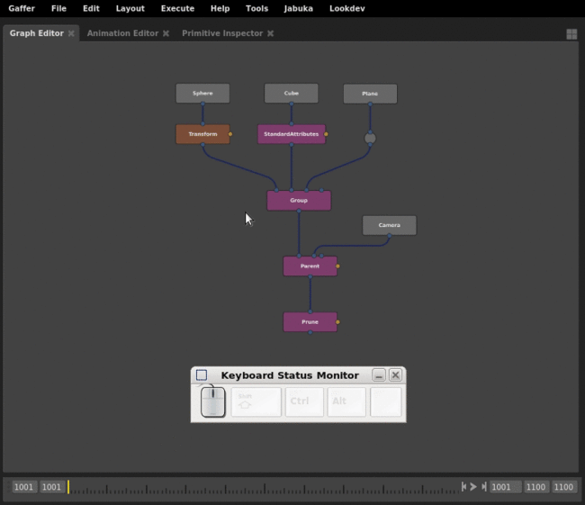
*Select upstream nodes with Shift+Alt+Click. Select downstream nodes with Ctrl+Alt+Click*
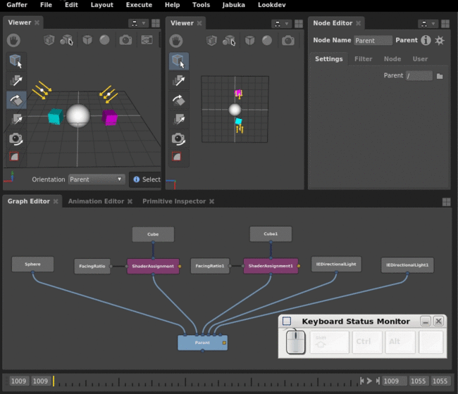
*Middle-drag a node from the GraphEditor to pin it to a Viewer or Editor. “n” quickly unpins a Viewer or Editor*
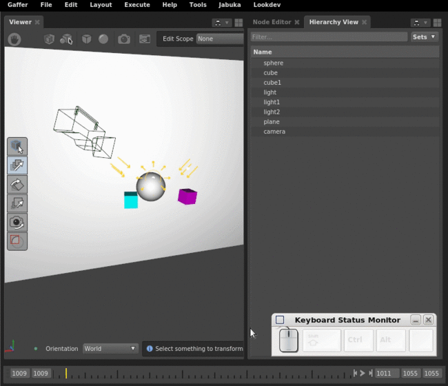
*Use Selection Masking to limit what’s selectable in a Viewer*
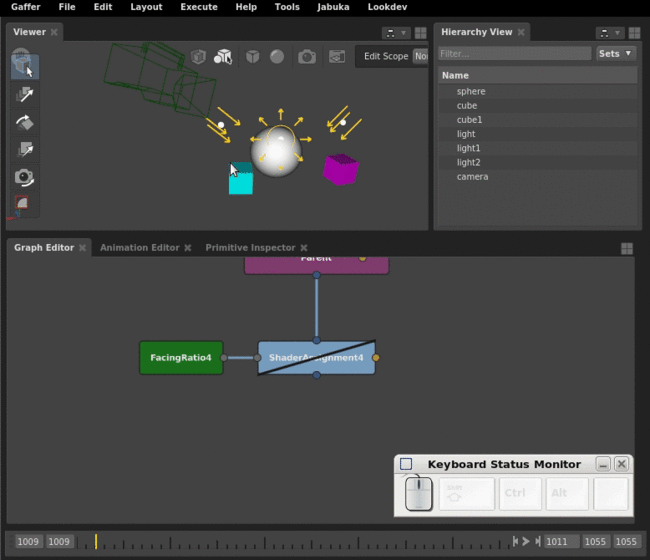
*Use Select Affected Objects to quickly select all objects affected by a filtered node*
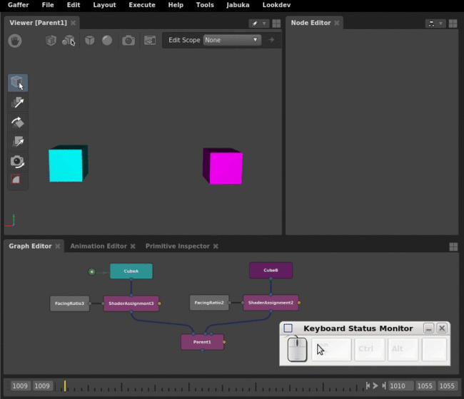
*Drag a plug into the expression editor to access the plug’s value*
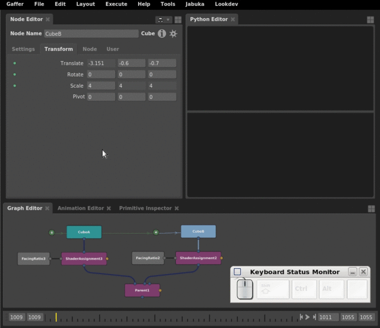
*Drag a plug from the Node Editor into the Python Editor for easy access*
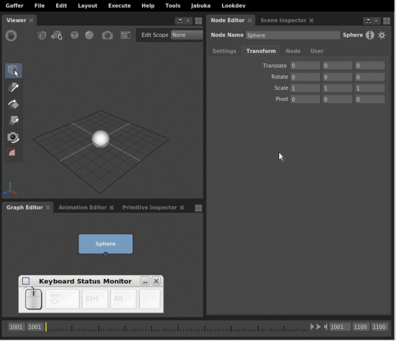
*Gang plug values together with Ctrl+G*
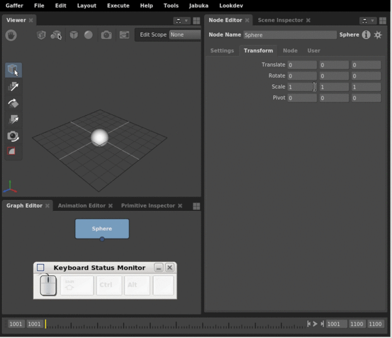
*Edit a plug value by holding Ctrl or Ctrl+Shift and then click-dragging left or right*
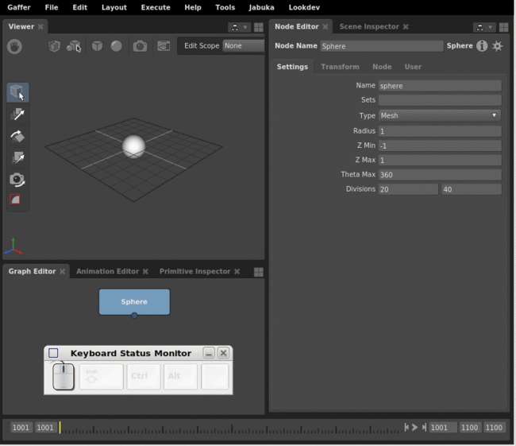
*Edit plug values with cursor up/down/left/right*
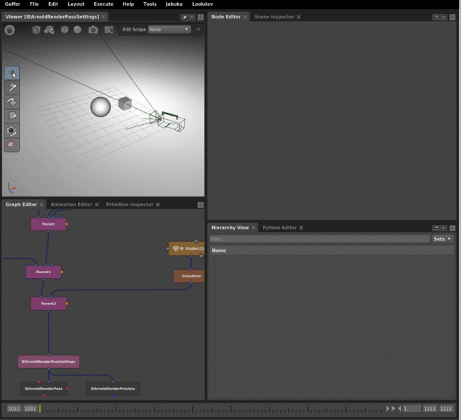
*Copy camera position from the viewer*
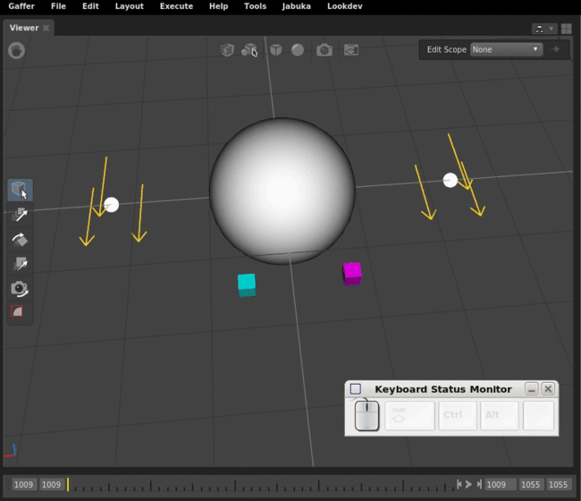
*Hold “v” with the translate or rotate tools enabled to snap or aim at the point clicked*
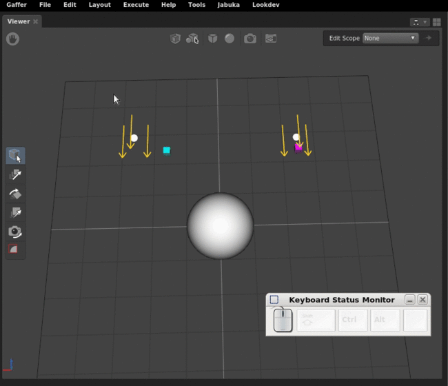
*Snap and aim also works with multiple selected objects*
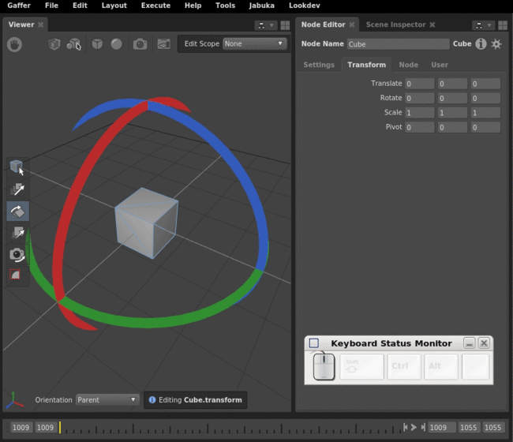
*Hold Shift while rotating to make precise adjustments. Hold Ctrl to step in 30 degree increments.*
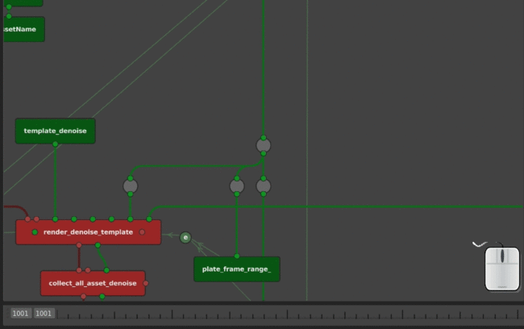
*Navigate Graph By Connection*
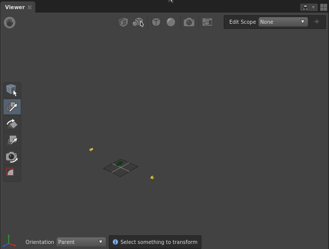
*Overriding visualiser scale in the Viewer*
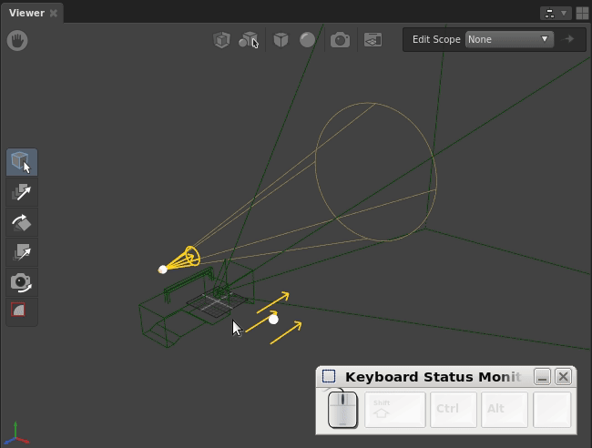
*Scaling manipulators with hotkeys*
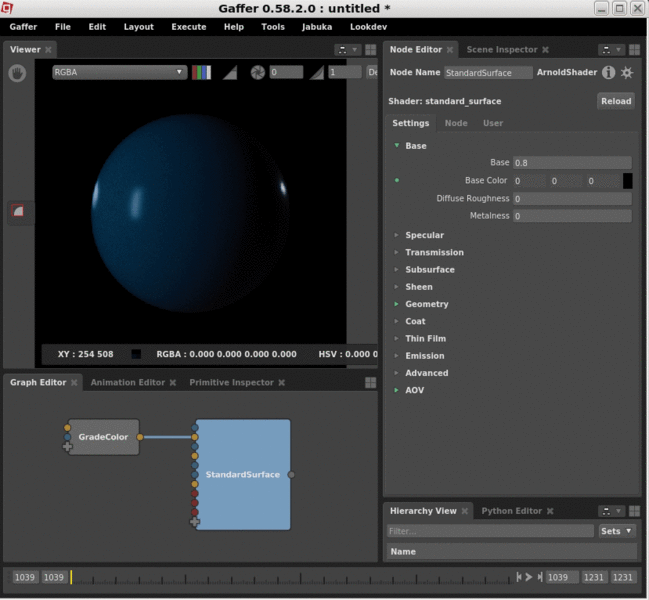
*Math operators when editing plugs*