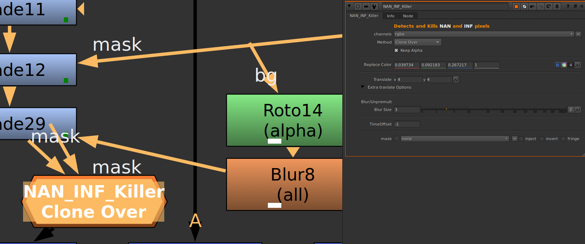
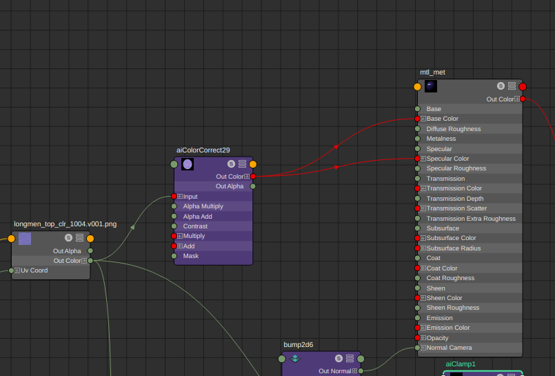
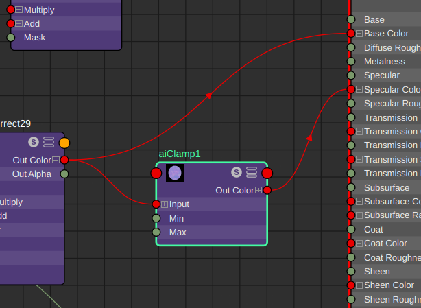

# Nan/inf
---
## Nuke
因为材质问题，出现了‘Nan’的黑点

提高采样渲染解决不掉的情况下

在nuke里（nuke14）使用NAN_INF_Killer去除

贴一个社区里遇到同样问题的

https://forums.autodesk.com/t5/arnold-gpu-forum/arnold-gpu-nan-zero-value-pixels/td-p/11948733

## Maya

在回到maya里检查材质的时候，mix shader只有shader2是有问题的，看他的连法：

这里用了一张法线当作颜色和高光颜色，当我们去掉高光颜色，nan坏点消失了，然后再看他对这张法线颜色贴图做的操作

aiColorCorrect：
Exposure=1

怀疑是这里把Exposure提高了，导致Specular Color采样的时候有些数值太大导致的

这里在shader2的Specular Color连接处加一个aiClamp，钳制住颜色数值的范围，让它在0-1之间。

点击测试渲染，黑点消失。