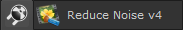
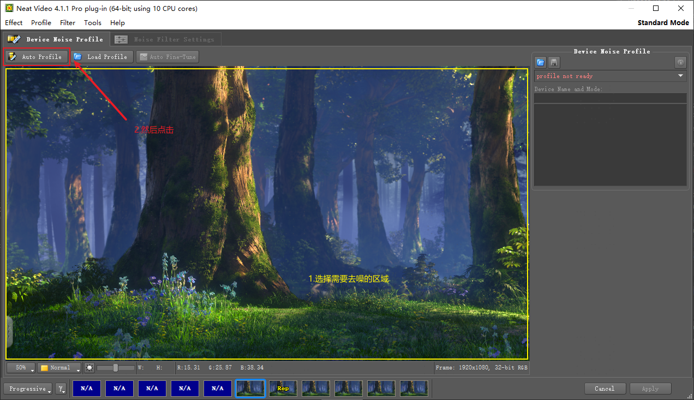
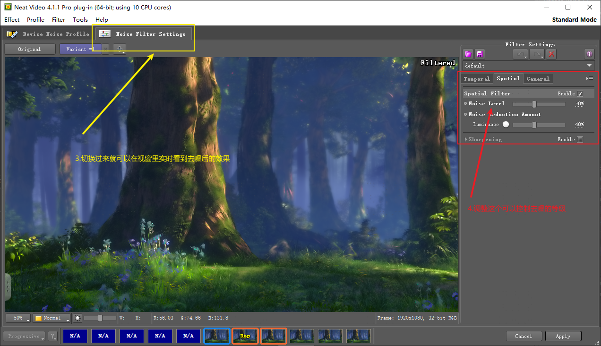

## 用于Denoise和Median去除不了的地方


如果第一次开启有需要填写key，可以复制粘贴以下
```
username: HaxxoR

companyName: AMPEDlb

nLics: 99

key=ZTGAZNOAZJ3AZED
```
按照顺序填上就可以开始使用了

<font color=red>（使用之前需要先导入素材，时间轴需要挪到开始的那一帧）</font>

