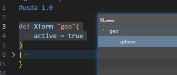
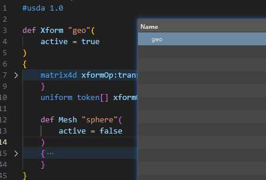

# active
```python
#在对应的层级上添加
def Xform "geo"(
    active = true 
    # active = false
)
{
    ...
}
```


# assembly
```python
def Xform "geo"(
    kind = "assembly"
    # kind = "subcomponent"
    # kind = "assembly"
    # kind = "component"
    # kind = "group"
)
{
    ...
}
```
